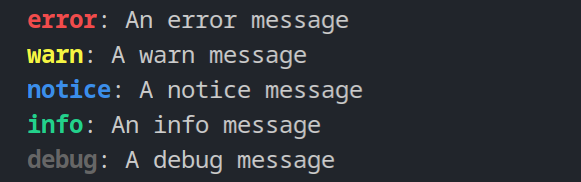
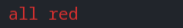

# Hackle

A hackable logger for the 21 Century

## Basic Usage

```ts
import { makeHackle, tools } from "https://deno.land/x/hackle/mod.ts";

const hackle = makeHackle();
const print = hackle.debug;

hackle.warn("Take a look at hackle", hackle);
print("after `hackle.warn`");
hackle.logStack(); // Logs the call stack to the 'debug' level

hackle.setLoggers([
	tools.makeFileLogger(".log", { prependTime: true }),
	tools.consoleLogger,
]);
hackle.setLogLevel("info");  // Setting this to `null` is akin to entering silent mode

print("will not show");
hackle.notice("on the console and in a log file in the `.log` directory");
```

To make things easier, you can just import `init.ts` at the top of the main entry to your application. This just sets the `hackle` and `print` variables to the values in the first example.

```ts
import "https://deno.land/x/hackle/init.ts";

hackle.error("an error");
print("something to the debug level");
```

### Appearance

By default logs take on the following appearance, but this is completely customizable.



### Log Levels

The precedence of the 5 log levels are as follows:
- `error`
- `warn`
- `notice`
- `info`
- `debug`

## Scopes

The backbone of Hackle is the principle of scopes. Scopes are added like this...

```ts
import 'https://deno.land/x/hackle/init.ts'
import { green } from 'https://deno.land/std/fmt/colors.ts'

hackle.addScope({
	name: 'download',
	prepend: green('Download'),
	level: 'notice'
})
```

...and accessed like this:

```ts
const notifyDownload = hackle.scope('download')

// ... download something ...

notifyDownload('https:something.com')
```

Console:


Internally, hackle uses a set of default scopes behind the scenes.  You can disable this by setting the `rejectDefaultScopes` option to true, or by calling `hackle.removeDefaultScopes`.

```ts
import { makeHackle } from 'https://deno.land/x/hackle/mod.ts'

const hackle = makeHackle({ rejectDefaultScopes: true })

// or

hackle.removeDefaultScopes()
```

This way we can easily change the behavior of `hackle.error`, for example, because internally it just calls the 'default-error' scope.

```ts
function makeHackle(options: MakeHackleOptions) {
	// ...

	function error(...message: any[]) {
		scope('default-error')(...message)
	}

	// ...

	return {
		// ...
		error,
		// ...
	}
}
```

To do this, we just need to create a new 'default-error' scope.  If the scope already exists, it will be overwritten.

```ts
hackle.addScope({
	name: 'default-error',
	messageMap(message) {
		return red(tools.defaultStringify(message))
	},
	level: 'error',
})

hackle.error('all red')
```

Console:



## Development

All contributions are heartily welcome!

Hackle uses [dirt](https://github.com/Vehmloewff/dirt-cli) to help with project configuration.

```sh
git clone https://github.com/Vehmloewff/hackle
cd hackle
dirt
```

## License

[MIT](./LICENSE)
